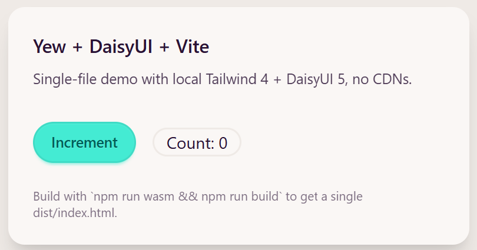

# Yew + DaisyUI + Tailwind + Vite (Single HTML File)

This is a minimal Yew app compiled to WebAssembly and bundled with Vite,
using Tailwind CSS + DaisyUI fully locally (no CDN dependencies).



The production build uses `vite-plugin-singlefile`, so the final output is a
single `dist/index.html` with JS/CSS/WASM inlined.

## Project Structure

This repository is now a single-root layout:

- `Cargo.toml` - Rust crate config (`cdylib` for wasm)
- `src/lib.rs` - Yew app entry/component tree
- `index.html` - Vite HTML entry
- `src-ts/main.ts` - TypeScript bootstrap that loads the wasm module
- `src-ts/style.css` - Tailwind + DaisyUI styles
- `vite.config.ts` - Vite plugins (Tailwind, single-file, compression)
- `target/pkg/` - `wasm-pack` output consumed by Vite
- `dist/` - production output from `npm run build`

## Prerequisites

```bash
rustup target add wasm32-unknown-unknown
cargo install wasm-pack
npm install
```

## Development

```bash
# build wasm package into target/pkg
npm run wasm

# start Vite dev server
npm run dev
```

## Production Build

```bash
npm run wasm
npm run build
```

Then open `dist/index.html` in your browser.
